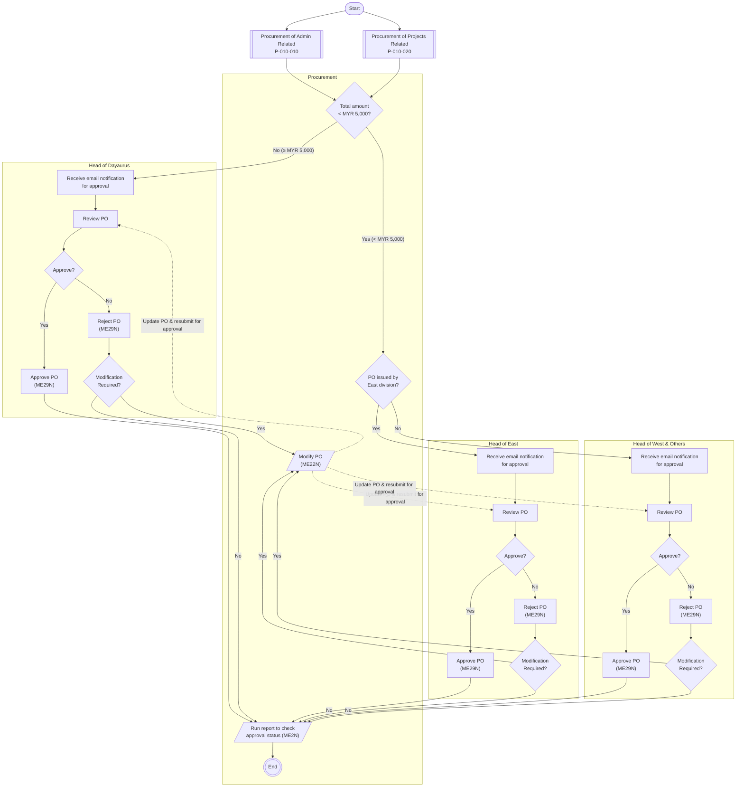

```mermaid

flowchart TD
    Start([Start]) --> P1[[Procurement of Admin Related<br/>P-010-010]]
    Start --> P2[[Procurement of Projects Related<br/>P-010-020]]

    P1 --> D1
    P2 --> D1

    subgraph PROC[Procurement]
        D1{Total amount <br/>< MYR 5,000?}
        D2{PO issued by<br/>East division?}
        ModifyPO[/"Modify PO<br/>(ME22N)"/]
        RunReport[/"Run report to check<br/>approval status (ME2N)"/]
        End(((End)))
    end

    D1 -- "No (≥ MYR 5,000)" --> HODReceive
    D1 -- "Yes (< MYR 5,000)" --> D2
    D2 -- Yes --> EastReceive
    D2 -- No --> WestReceive

    subgraph HOD["Head of Dayaurus"]
        HODReceive[Receive email notification<br/>for approval]
        HODReview[Review PO]
        HODApprove{Approve?}
        HODApprovePO["Approve PO<br/>(ME29N)"]
        HODReject["Reject PO<br/>(ME29N)"]
        HODMod{Modification<br/>Required?}
    end

    HODReceive --> HODReview --> HODApprove
    HODApprove -- Yes --> HODApprovePO --> RunReport
    HODApprove -- No --> HODReject --> HODMod
    HODMod -- Yes --> ModifyPO
    HODMod -- No --> RunReport

    subgraph HOE["Head of East"]
        EastReceive[Receive email notification<br/>for approval]
        EastReview[Review PO]
        EastApprove{Approve?}
        EastApprovePO["Approve PO<br/>(ME29N)"]
        EastReject["Reject PO<br/>(ME29N)"]
        EastMod{Modification<br/>Required?}
    end

    EastReceive --> EastReview --> EastApprove
    EastApprove -- Yes --> EastApprovePO --> RunReport
    EastApprove -- No --> EastReject --> EastMod
    EastMod -- Yes --> ModifyPO
    EastMod -- No --> RunReport

    subgraph HOW["Head of West & Others"]
        WestReceive[Receive email notification<br/>for approval]
        WestReview[Review PO]
        WestApprove{Approve?}
        WestApprovePO["Approve PO<br/>(ME29N)"]
        WestReject["Reject PO<br/>(ME29N)"]
        WestMod{Modification<br/>Required?}
    end

    WestReceive --> WestReview --> WestApprove
    WestApprove -- Yes --> WestApprovePO --> RunReport
    WestApprove -- No --> WestReject --> WestMod
    WestMod -- Yes --> ModifyPO
    WestMod -- No --> RunReport

    ModifyPO -.->|Update PO & resubmit for approval| HODReview
    ModifyPO -.->|Update PO & resubmit for approval| EastReview
    ModifyPO -.->|Update PO & resubmit for approval| WestReview

    RunReport --> End
```
