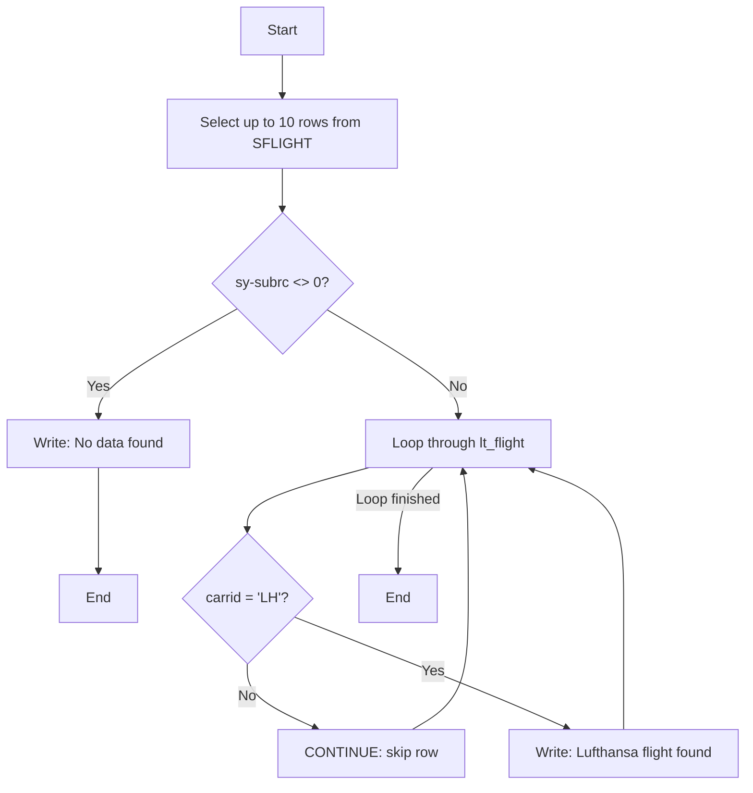

```mermaid
flowchart TD
    A[Start] --> B[Select up to 10 rows from SFLIGHT]
    B --> C{sy-subrc <> 0?}
    C -->|Yes| D[Write: No data found]
    D --> E[End]
    C -->|No| F[Loop through lt_flight]
    F --> G{carrid = 'LH'?}
    G -->|No| H[CONTINUE: skip row]
    H --> F
    G -->|Yes| I[Write: Lufthansa flight found]
    I --> F
    F -->|Loop finished| J[End]
```
